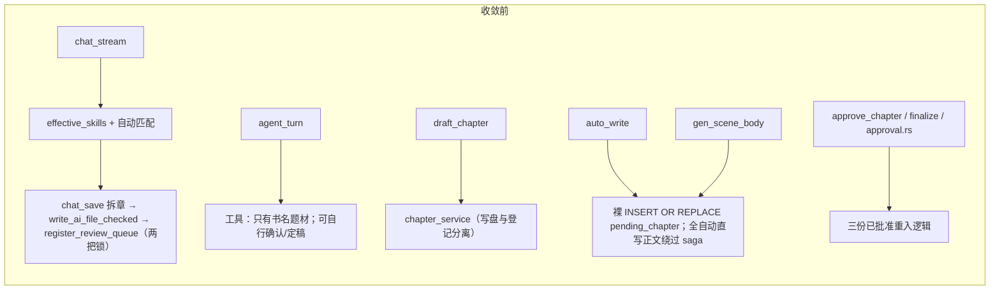
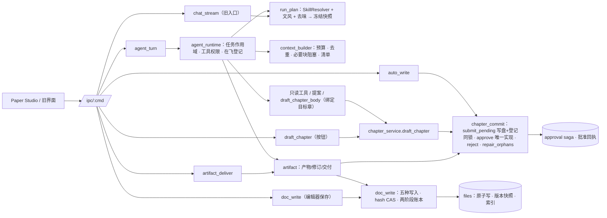

# 02 · 架构：服务边界、调用链收敛与事实来源

> 原则：保留 Rust 单端口与现有 workspace，不新增微服务/中间件/插件平台。新增能力全部落在 `molan-core`（可单测的领域/应用服务）与 `molan-server`（传输与编排），前端是新的 `frontend/`。

## 1. 分层与职责

| 层 | 位置 | 职责 | 不负责 |
|---|---|---|---|
| UI | `frontend/src` | 页面、编辑器、技能选择、任务状态、产物卡片 | 决定文件是否已保存（一律读回执/投影） |
| 传输 | `main.rs` `web.rs` `handlers/mod.rs` `handlers/v2.rs` | `/ipc/:cmd`、NDJSON、Cookie 鉴权、静态托管、旧命令兼容 | 创作业务规则 |
| 应用服务 | `molan-core::{doc_write, artifact, artifact_view, artifact_legacy, skill_resolver, chapter_commit, task_kind}`、`stream::{run_plan, context_builder, agent_runtime, chapter_service}` | 写入计划与回执、产物与交付、技能计划冻结、上下文组装、章节提交/定稿、Agent 作用域 | 网络传输细节 |
| 领域与持久化 | `files` `approval` `continuity` `outline_confirm` `chapter_state` `agent_run` `skill_rev` | 原子写、CAS、版本快照、审批 saga、记忆、细纲确认、运行账本、技能版本 | — |
| 模型适配 | `molan-llm` | 渠道/角色解析、流式调用、工具调用、usage、有限重试、取消、mock | 业务决策 |

**事实来源**：书稿文件、待审队列、批准回执、细纲确认回执、写入账本是领域事实；`agent_run` 只记录执行进度；产物卡片的状态由「交付记录 × 当前磁盘/队列」实时投影。消息文本、localStorage、`run.status` 都不能证明「正文已定稿」。

## 2. 调用链：收敛前后

逐项收敛：

| 重复/分叉（基线编号） | 收敛到 | 旧入口现状 |
|---|---|---|
| 三份已批准重入（2.1-#、§2） | `chapter_commit::approve` | `approve_chapter`、`approve_all_pending`、Agent `finalize_draft`、产物「定稿」全部调用它 |
| 写待审与登记分属两把锁（#18） | `chapter_commit::submit_pending`（AI 新章）/ `write_review_and_register`（旧入口，保留各自写入规则） | 单章起草、自动写作待审分支、场景首段、产物「提交待审」、聊天兜底落盘与停机残稿、聊天拆章保存、`save_chat_output`、`write_file`→正文待审、`save_partial_as_review`、`assemble_scene_doc`、消息结果保存 |
| 裸 `INSERT OR REPLACE pending_chapter` | `register_pending` / `record_auto_approved`（同事务） | 自动写作三处、场景一处均已替换 |
| 技能解析三套 + 任务表三份（#7-#11） | `skill_resolver` + `task_kind` | `effective_skills` 成为兼容包装；聊天、Agent、单章、自动写作、预览共用 `run_plan::build` |
| 文风/去味各自读最新设置 | `run_plan`（冻结） | `build_system_with` 的去味方法来自计划（本次覆盖生效） |
| 细纲双重注入（#12） | `append_target_outline` 认两种标题 | 回归测试 `body_outline_is_injected_exactly_once` |
| 版本快照非原子 / 同毫秒覆盖（#21） | `files::save_version` 原子写 + 不覆盖（顺延 ts） | 所有覆盖写入前的快照 |
| 预览与执行上下文不同源 | `task_preview` 与 `agent_turn` 都读 `contextFiles` | 作者附带资料在预览中可见 |
| DeepWrite 绑定技能绕过解析（自动写作重写 / 去味阶段直接拼接） | SkillResolver 的 `deepwrite` 来源 + `run_plan::stage_plan` | 自动写作、单章起草、聊天、场景的去味 / 重写 / 审稿子阶段 |
| 子阶段沿用正文任务配置、运行中读最新设置 | 子阶段按各自任务解析并在任务开始时冻结（`stage_plan`） | 自动写作把 `revise / humanize / review` 计划与正文计划一起冻结 |
| 三处审稿提示各自拼接 | `chapter_review::review_system`（固定协议 + 审稿技能 + 协议硬约束） | 单章、自动写作、复核、聊天 |
| 去味替换、场景追加：CAS 与重新登记分属两把锁 | `chapter_commit::rewrite_pending` | 章节服务去味、decompose 场景追加 |
| 章节 / 提案 / 建书写入不进写入账本 | `doc_write::record_external` / `record_ai_create` | 所有写入来源在 `doc_history` 中可查 |
| 旧聊天附带资料不尊重「对 AI 隐藏」 | `context_builder::legacy_context_text` | `chat_stream`（逐项报告 `meta.contextFiles`） |
| `draft_skill` 与技能草稿 | `handlers/skill_draft.rs::generate` | 旧 `draft_skill` 形状不变；新增技能草稿产物 |
| 导入失败留半成品 | `book_import::import_book` | txt / 文件夹 / zip 导入 |
| 并行记忆抽取导致后章误判 | 串行 `spawn_post_approved` / `spawn_memory_sync` | 批量定稿与收尾补发均按章序 |

## 3. 权限模型（Agent）

| 任务 | 可用工具 | 产物 |
|---|---|---|
| 聊天 | 只读 7 个 | 无（普通消息） |
| 剧情 / 细纲 | 只读 + 修改提案 | 最终文本 → 剧情推演 / 细纲草稿 |
| 正文（指定章） | 只读 + `draft_chapter_body`（章号必须等于目标章） | 章节服务提交的待审稿 → 正文草稿卡（待审） |
| 修改 / 去味 / 审稿 / 总结 | 只读 | 修改稿（选区=片段）/ 审稿报告 / 总结 |
| 旧版助手（未传 task） | 旧工具集 **去掉** 确认/定稿 | 同旧行为 |
| 任意 | **确认细纲、定稿永远不给模型**；模型编造调用会被服务端拒绝并回灌结构化原因 | — |

`direct` 模式：不带工具单次生成（模型不支持 tools 时由作者显式选择）。bookId 由会话归属绑定，模型不能提供路径或换书；技能只影响提示，不扩大权限。

### 3.1 工具执行（`stream/tool_exec.rs`）

- **只读结果缓存**：同一次运行内按「工具名 + 规范化参数」缓存成功结果；每次取用前核对作品状态戳（文件版本、待审队列、章节状态与记忆、细纲确认、技能版本 / 启停、本书设置与文件可见性、作品元数据），任一变化即重读；任何有副作用的工具执行后清空缓存。同一轮里重复的同参调用只执行一次。直接改磁盘文件（不经本服务）不会更新状态戳，不在保证范围内。
- **有限并发**：同一轮里连续的只读调用最多 4 个同时执行（作用域线程）；数据库查询仍经单连接锁串行，文件读取可以重叠。提案、草稿、起草正文等有副作用的调用逐个顺序执行。结果按模型给出的原顺序回填，tool_call_id 一一对应；取消在每组 / 每个有副作用的调用之前检查。
- **运行指标**：首字时间（从收到请求起算，含计划冻结与上下文组装）、每次模型调用的首个片段 / 首个正文片段时间、总耗时、提示与产出字数、结果（toolCalls / ok / empty / error）、用量来源（上游报告或估算）；每次工具调用的耗时、是否命中缓存、是否并发执行；重试次数、运行总耗时。随 `done` 事件、消息 `result_json` 与 `run_status` 返回，界面在运行卡与历史消息下显示一行摘要。
- **写入耗时**：`doc_write` 回执附 `durationMs`；`artifact_deliver` 结果附 `ms`；单章起草回执附 `timings`（前置检查 / 生成 / 去味 / 落盘待审 / 审稿 / 总计）。

## 4. 技能计划（SkillResolver）

优先级（全部在 `skill_resolver.rs` 有单测）：
1. 本次主技能（`primarySkillId`）只要适用任务就替代作品主技能（不再看 usage_mode）；被替代的作品主技能列入「未使用」并写明「只影响本次，不改作品默认」。
2. 旧式混合列表与本次辅助里 usage=primary 的卡视为主技能候选；同任务只保留第一个，其余 `MULTI_PRIMARY`。
3. 名称自动匹配（旧聊天）只能叠加辅助，不能替代主技能（`AUTO_MATCH_NO_REPLACE`）。
4. 作品辅助始终叠加；按 id 去重；查找顺序 id → builtin_key → 名称（确定性）。
5. 不存在/停用/空模板/不适用/文风卡分别给出 `NOT_FOUND / DISABLED / EMPTY_TEMPLATE / NOT_APPLICABLE / STYLE_CHANNEL` 原因；文风卡被当技能选中时改作本次文风。
6. 文风/去味：本次覆盖 > 作品设置；停用或空模板的文风卡、去味技能回落并说明。

7. DeepWrite 绑定（`dw_book_skill`）是 `deepwrite` 来源，只在子阶段（`Selection.deepwrite=true`）启用，与其他来源一样校验适用性并按 id 去重。

**子阶段计划**（`run_plan::stage_plan`）：审稿后重写 = 修改、去AI味 = 去AI味、审稿 = 审稿，各自按自己的任务解析；不继承主任务的显式主 / 辅技能（正文写作卡不会进入去味或审稿），只继承文风与去味覆盖。审稿技能注入时附「协议硬约束」，不改变 JSON 输出协议。

冻结：`run_plan::build` 计算 `planHash`（技能 id+rev+模板 hash、文风 hash、去味 hash），把含模板全文的完整计划写入 `skill_plan_snapshot`；运行与自动写作整批章节只读快照。`input_fingerprint` 不再哈希整张技能表（编辑无关技能不再让在飞章节被拒；作品级技能绑定仍参与比较）。

## 5. 上下文（ContextBuilder）

- 聊天：作品概况 + 作者显式附带资料；不自动塞全书。
- 剧情/细纲/正文（有章号）：沿用 `auto_book_context_for_chapter`（已定稿记忆、前章结尾、目标细纲），正文缺细纲即阻塞。
- 修改/去味/审稿/总结：以目标文本为核心；选区按基线 hash + UTF-16 偏移在服务端重新切片，原文已变或选区文本不一致即阻塞；超长目标要求缩小范围。
- 显式资料：单个 6000 字、总 16000 字，截断/跳过（aiOff、不存在、超预算）逐项记录。
- 每次运行写上下文清单（块、截断、技能版本、planHash），前端「上下文」面板展示。

## 6. 写入语义（DocumentWriteService）

| 操作 | 前提 | 冲突 |
|---|---|---|
| create | 目标不存在（同名同内容视为 noop） | `TARGET_EXISTS` |
| replace / append | 携带基线 hash | `BASE_CHANGED`（返回当前 hash） |
| insert | 基线 + UTF-16 偏移（不得落在代理对中间） | `RANGE_INVALID` |
| replace_range | 基线 + [start,end) + 原选区文本逐字一致 | `SELECTION_CHANGED` |

两阶段账本 `doc_write_log`：先记 `prepared`（写前/写后 hash、计划 hash）→ 原子写（临时文件+fsync+回读+替换，写前版本快照）→ 记 `committed`。崩溃窗口：
- prepared 后、落盘前：磁盘仍是旧 hash → 重试重新执行；启动对账标 `aborted`；
- 落盘后、账本收尾前：磁盘已是新 hash → 重试只补记 `committed`（不重复追加）；启动对账补记；
- 文件已写、派生索引失败 → `commit=committed, index=failed`（部分成功，文件保留）。
同 `(bookId, idempotencyKey)` 重放返回原回执；同键异内容拒绝。`正文待审` 只能经章节服务写入。AI 产物交付以 `actor=ai` 写入（尊重作者锁定）；作者保存为 `actor=user`。

其他写入服务（章节提交 / 定稿 / 全自动定稿、去味替换、场景追加、提案接受、建书资料）保留各自业务规则，落盘后用 `doc_write::record_external` 记同形状的 WriteReceipt（`source.service` 标明来源），因此 `doc_history` 能看到一个文档的全部写入。

审稿结论按被审文本 hash 记入 `chapter_review_log`；待审区以当前稿 hash 比较，显示「针对当前版本」或「已失效」。

文件系统与 SQLite 之间**没有**全局事务：一致性靠「账本相位 + 磁盘 hash 对账」，不宣称原子。

## 7. 状态机

**运行**（`agent_run.status` 原值保留，`state_of` 映射）：running(在飞) → completed / interrupted / failed / budget_exhausted；遗留 running 在启动时对账为 interrupted（附已落轮次与产物数，绝不自动重跑）。同 `(session, request)` 幂等；同会话不同请求在飞 → `SESSION_BUSY`。停止只取消在飞令牌，不再登记会话标记（修复上次取消毒化下一条请求）。

**产物**：generating / generated / interrupted / failed / discarded / base_changed / saved / partial / pending_review / confirmed / approved / rejected / stale / conflict。不是线性流程：例如细纲 saved ≠ confirmed，待审 ≠ 定稿；文件在交付后被改 → stale；多文件按条目统计「N 项成功，M 项冲突或失败」。

**文档保存**：clean → dirty → saving → saved / conflict / failed；保存的是发起时快照，保存期间的新编辑仍是 dirty。

## 8. 有意的行为变化（均有测试）

1. 模型不能确认细纲/定稿（工具从目录移除，调用被拒）。
2. 工具轮数用尽 → 一次无工具收尾轮，状态 done + `ROUNDS_EXHAUSTED` 提示（原为直接 budget_exhausted）。
3. 空回复 → 有限重试后 `EMPTY_OUTPUT` 失败（原为 done）。
4. 上游未报 usage → 按字数估算计入预算并标记（原为记 0）。
5. 多个显式主技能只保留第一个；文风卡不再作为技能重复注入；停用的文风卡/去味技能不再生效。
6. `apply_asset_update` 缺参报错、拒绝写正式「正文」、尊重锁定（原为静默成功/可覆盖正式稿）。
7. 提案接受时文件已写但索引失败 → 状态 accepted + `indexError`（原为回滚 pending，之后永远无法接受）。
8. `write_skill_ref`、改 targets/usage/kind 也会升技能版本。
9. DeepWrite 绑定技能按任务适用性筛选：去AI味阶段只注入适用「去AI味」的技能（原为全部绑定技能都注入）。
10. 审稿阶段注入作品为「审稿」绑定的技能（附协议硬约束）；原为不注入任何技能。
11. 旧聊天入口不再注入「对 AI 隐藏」的附带资料（原会注入），并在 meta 中报告。
12. 自动写作的去味方法在任务开始时冻结（原为每章读取最新设置）。
13. 导入中途失败时半成品作品移入作品回收站并报错（原为留下残缺作品）。
14. Agent 内起草正文按「提示 + 产出」估算计入预算（原只计产出）。
15. 单章模式自动写作仍不自动审稿（保持原行为，不增加模型调用），待审区如实显示「尚未审稿」，作者可手动「审稿当前版本」。

## 9. 兼容与回退

- 新增 IPC 全部为加法（见 03-contracts）；旧命令参数语义与返回结构保留（新增字段为可选）。旧 `messages.result_json`（doc/docs/bookSetup）与 Agent `steps_json` 工件由 `artifact_legacy` 只读投影成卡片，状态同样按磁盘复核。
- Schema 全部 additive：新表 `doc_write_log`、`skill_plan_snapshot`、`artifact`、`artifact_rev`、`artifact_delivery`；`agent_run` 新增 `usage_estimated/plan_hash/manifest_id/mode`（PRAGMA 探测幂等补列）。旧二进制打开新库会忽略这些表与列。
- 回退旧界面：把旧静态树（如生产当前发布的 `web-reviewed`）放到 `MOLAN_WEB_DIR` 即可；不带 `paper-studio` 标记的 HTML 自动注入原有 glue/pipeline_ui/agent_ui。
- 回退旧二进制：新增表/列不影响旧版本读取；但新版写入的产物/账本旧版不可见（无数据损失）。
